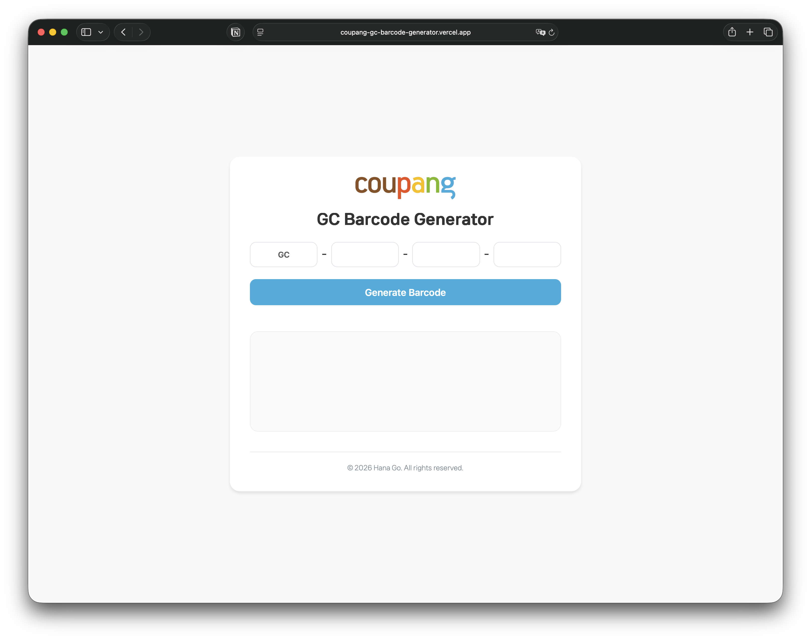

  

  
  
  

  
  
  

`GC Barcode Generator`는 coupang에서 사용하는 GC 바코드를 생성하는 페이지입니다.
자동 대문자 변환 기능이 있어 간편하게 사용할 수 있습니다.

## 사용 기술

- `HTML`
- `CSS`
- `JS`

## 시작하기

### 사용 방법

웹 브라우저에서 다음 링크를 열어 바로 사용할 수 있습니다:

[https://coupang-gc-barcode-generator.vercel.app/](https://coupang-gc-barcode-generator.vercel.app/)

